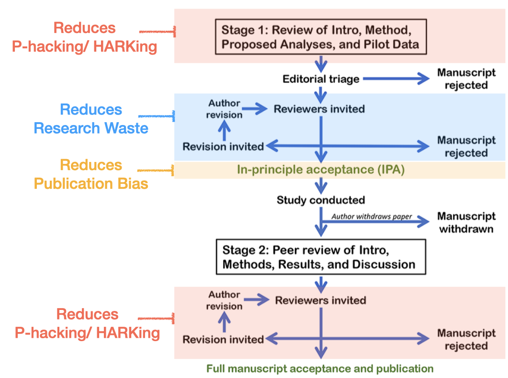

$^*$ Lead Authors 
$^+$ Listed in alphabetical order 
$^1$ Institute of Ecology and Evolution, University of Edinburgh  
$^2$ Department of Computational Landscape Ecology, UFZ-Helmholtz Centre for Environmental Research, Permoserstrasse 15, Leipzig, 04318, Germany 
$^3$ Centre for Biodiversity and Conservation Science & School of the Environment, The University of Queensland,  Brisbane, Australia 
$^4$ School of Biodiversity, One Health, and Veterinary Medicine, University of Glasgow, Glasgow, UK 
$^5$ Department of Behavioral Science Methodology, Faculty of Psychology, Universidad Nacional de Educación a Distancia (UNED), Madrid (Spain) 
$^6$ Department of Biological Sciences, University of Alberta, Edmonton, Canada 
$^7$ Emmett Interdisciplinary Program in Environment and Resources, Stanford University, Stanford, California, United States of America 

**Approved by the 2024 Diversity, Equity and Inclusion committee and 2024 Board of Directors**

# Summary
1. Pre-registration is a practice that aims to increase transparency and reduce questionable research practices (QRPs) such as p-hacking and HARKing. A registered report is an article format that extends pre-registration and aims to additionally reduce research waste and publication bias.
2. Evidence for the benefits of pre-registration in terms of reducing QRPs is mixed; often pre-registrations are not followed, reducing their value. There is much clearer evidence for registered reports reducing QRPs and publication bias, as well as increasing the quality of published articles.
3. There is no research on pre-registration and registered reports in ecology and evolution, and uptake of the practices is currently very low.
4. Based on the evidence reviewed in the following sections, SORTEE strongly supports the use of both pre-registration and registered reports.

# What are pre-registration and registered reports, and why are they important
There is considerable pressure on scientists to rapidly produce innovative and significant results. Traditional publication practices favour statistically significant results (typically assessed using statistical measures, such as p-values). This is known as publication bias, and leads to multiple unwanted effects. First, researchers may not try as hard to publish non-significant results, exacerbating the problem [known as the file drawer effect; @rosenthal1979]. In addition to distorting the evidence in the published literature, publication bias incentivises what are known as Questionable Research Practices (QRPs), and in particular, the selection of data and/or analyses that lead to significant p-values [aka p-hacking; @simonsohn2014] or the formulation of hypotheses after data analysis [aka Hypothesising After Results Known, or HARKing; @kerr1998]. These QRPs inflate effect sizes and increase false positive rates [@ioannidis2005; @forstmeier2017a]. Finally, the combination of publication bias and the fact that a lot of published research is underpowered leads to an inflation of effect sizes [@sterne2000]. This occurs because, at low power, only effect sizes larger than the true effect pass the significance threshold, and these are more likely to be published. The scientific community has taken steps towards preventing these problematic practices while ensuring quality of research. Two main approaches have been implemented: pre-registration and registered reports. Both approaches aim to increase the transparency and robustness of scientific results, and reduce QRPs and misconduct.

A pre-registration is a time-stamped, read-only research plan that is written (and either made public or embargoed) prior to an analysis [@wagenmakers2012], for example using the Open Science Framework (OSF). When researchers specify their hypotheses and a detailed analysis plan in advance, their ability to HARK and p-hack (whether consciously or not) is greatly reduced (assuming the pre-registration is followed), deviations from the plan become more transparent. Although researchers can create a pre-registration after conducting an analysis (intentional misconduct), this creates a higher bar for intentionally conducting QRPs, and so should reduce their incidence. In theory, the pre-registration provides a means for the reviewers/readers to see the process of the conceptualization and implementation of the project. Deviations from the originally specified hypotheses, methods or analyses should be documented and justified in the subsequent manuscript [@lakens2024; @willroth2024].

Registered reports effectively combine the concept of pre-registration with the peer review process [@chambers2022]. A registered report is a type of research article where the Introduction and the Methods sections of a manuscript are submitted to a scientific journal for peer review prior to data collection/analysis. After the first stage of review, articles are either given an in-principle acceptance (IPA) or rejected. The IPA guarantees that the article is published regardless of what results are found, as long as the authors conduct the research as laid out in stage 1. In addition to addressing the issues of p-hacking and HARKing, registered reports also reduce research waste and publication bias. By allowing peer review before the work is conducted, registered reports allow for any experimental design problems to be corrected in advance. The IPA is designed to ensure that studies are published based on their scientific quality, irrespective of their results, and so reduces publication bias. As both stages are reviewed, registered reports should also enforce adherence to the proposed analysis design, thereby reducing p-hacking and HARKing.  

Figure 1: Registered Reports workflow, highlighting the stages at which different issues are addressed. Edited from the original version at https://cos.io/rr/.

# General research on the costs and benefits of pre-registration and registered reports
A recent study shows the general impact of registration on primary research (predominantly in medical fields), and provides evidence that the increased adoption of registration (including the practices of pre-registration and registered reports) would make primary research more cost-effective by reducing research waste [@purgar2024]. Here, we separate out the costs and benefits of pre-registration and registered reports specifically (note that study registration in medicine and economics is typically subtly different to pre-registration and registered reports outlined above, with more emphasis on making sure there are records of all studies conducted, over pre-analysis planning and reduction of QRPs). 

## Costs and benefits of pre-registration
Pre-registrations help researchers map hypotheses to a strategy of study design and data analysis, reducing the scope for p-hacking and HARKing. Studies have assessed these effects by comparing the effect sizes in pre-registrations and standard papers (which would be expected to be smaller in the absence of p-hacking, as p-hacking acts to inflate effect sizes; @schafer2019;, @vandenakker2024), as well as the proportion of positive results (which would be expected to be lower in the absence of p-hacking and HARKing; @toth2021; @vandenakker2024). The resulting evidence of the efficacy of pre-registration is mixed. Importantly, the studies showing an effect of pre-registration on these practices do not differentiate between pre-registration and registered reports (@schafer2019, @toth2021), whereas the only study that considered pre-registrations alone found no evidence that pre-registration reduced these practices (@vandenakker2024; null results: 69% versus 68% (pre-reg versus non), effect size: 0.29 versus 0.36). The lack of evidence for effects can be explained by the lack of adherence of studies to their pre-registration. Several studies have shown that pre-registrations often lack specificity [@heirene2024; @brodeur2024], which allows undisclosed flexibility at the analysis stage. Further research has shown low adherence in terms of changing hypotheses [@vandenakker2023] and undisclosed deviations from an analysis plan [@heirene2024; @claesen2021; @vandenakker2023a], suggesting the potential for p-hacking and HARKing. Interestingly, one study directly assessed p-hacking in pre-registered studies and showed that p-hacking was only avoided when a specific analysis plan (and in particular, a power analysis) was presented [@brodeur2024]. There are likely other benefits to pre-registration other than the reduction of QRPs. For example, @sarafoglou2022 show that both researchers who have done pre-registrations and those who have not believe that pre-registration results in (among other things) a strong increase in the quality of analysis plans, research hypotheses, and experimental design research, with the disadvantages of a small increase in project duration and increases in work-related stress. Pre-registration is also associated with an increase in sample size across studies [@vandenakker2024; @schafer2019]

## Costs and benefits of registered reports
In contrast to the mixed evidence for realising the potential benefits of pre-registration, the positive impact of registered reports has been consistently documented. As noted above, studies grouping of pre-registrations and registered reports have shown they present lower effect sizes (@schafer2019; median of 0.16 in registered articles versus 0.36 in standard articles) and a lower proportion of significant results (@toth2021; 48% in registered articles versus 66% in standard articles) compared with standard papers, consistent with a reduction in p-hacking and HARKing. When considering registered reports alone, comparisons of registered reports and standard papers have also shown a large reduction in the proportion of positive results (@scheel2021; 44% versus 96% and  @allen2019; 49.5% versus 80-95%). Registered reports have also shown to be higher quality and more rigorous than standard papers across all aspects of a paper [@soderberg2021]. Interestingly, whether a study is a registered report or not appears not to affect the credibility of the research to the public [@costa2022].

# General research on pre-registration and registered reports in Ecology and Evolutionary Biology
There are no specific studies on the impact of pre-registration or registered reports on studies published in ecology and evolution journals, likely due to the current low uptake of the two practices (see below). However, Ecology and Evolutionary Biology (EcoEvo) are no exception when it comes to the prevalence of the aforementioned pathologies of widespread publication bias [@fanelli2012; @cassey2004; @yang2023; @kimmel2023], low power [@fidler2017; @yang2023] and QRPs [@fraser2018; @kimmel2023]. This has led to massive inflation of effect sizes in published literature [@kimmel2023; @yang2023]. Furthermore, it has been estimated that 45% of research in ecology is unpublished, and a further 67% of published literature is wasted due to poor study design [@purgar2022]. 

# State within Ecology and Evolutionary Biology
Despite efforts to increase their popularity over the past decade (e.g. @parker2016), the uptake of pre-registration and registered reports in the fields of Ecology and Evolutionary Biology has been slow. According to an informal survey, less than 1% of EcoEvo studies in 2023 included a pre-registration (JL Pick and E. Macartney, Unpublished), despite the calls for action. In social sciences, the uptake of pre-registration and registered reports was also initially slow (0-3% in 2014-2017 @hardwicke2020; hardwicke2022), but the practice is now becoming relatively common across many journals (0-25% in 2020 @tenney2021; 16% in 2021 in political science @scoggins2024; 7-16% in psychology in 2022 @). Little is known in ecology and evolution about the attitude of researchers towards pre-registration and registered reports.
Despite efforts to increase their popularity over the past decade (e.g. @parker2016), the uptake of pre-registration and registered reports in the fields of Ecology and Evolutionary Biology has been slow. According to an informal survey, less than 1% of EcoEvo studies in 2023 included a pre-registration (JL Pick and E. Macartney, Unpublished), despite the calls for action. In social sciences, the uptake of pre-registration and registered reports was also initially slow (0-3% in 2014-2017 @hardwicke2020; hardwicke2022), but the practice is now becoming relatively common across many journals (0-25% in 2020 @tenney2021; 16% in 2021 in political science @scoggins2024; 7-16% in psychology in 2022 @). Little is known in ecology and evolution about the attitude of researchers towards pre-registration and registered reports.
Despite efforts to increase their popularity over the past decade (e.g. @parker2016), the uptake of pre-registration and registered reports in the fields of Ecology and Evolutionary Biology has been slow. According to an informal survey, less than 1% of EcoEvo studies in 2023 included a pre-registration (JL Pick and E. Macartney, Unpublished), despite the calls for action. In social sciences, the uptake of pre-registration and registered reports was also initially slow (0-3% in 2014-2017 @hardwicke2020; hardwicke2022), but the practice is now becoming relatively common across many journals (0-25% in 2020 @tenney2021; 16% in 2021 in political science @scoggins2024; 7-16% in psychology in 2022 @). Little is known in ecology and evolution about the attitude of researchers towards pre-registration and registered reports.
Despite efforts to increase their popularity over the past decade (e.g. @parker2016), the uptake of pre-registration and registered reports in the fields of Ecology and Evolutionary Biology has been slow. According to an informal survey, less than 1% of EcoEvo studies in 2023 included a pre-registration (JL Pick and E. Macartney, Unpublished), despite the calls for action. In social sciences, the uptake of pre-registration and registered reports was also initially slow (0-3% in 2014-2017 @hardwicke2020; hardwicke2022), but the practice is now becoming relatively common across many journals (0-25% in 2020 @tenney2021; 16% in 2021 in political science @scoggins2024; 7-16% in psychology in 2022 @hardwicke2024). Little is known in ecology and evolution about the attitude of researchers towards pre-registration and registered reports.

# DEI Concerns
Many journals have moved from single-blind review (where only reviewers can be anonymous) to double-blind review (where both authors and reviewers are anonymous), in an attempt to reduce biases that can emerge when the author’s identity is known. When authors' identities are revealed during peer review, conscious or unconscious biases can influence the review process, e.g. relating to the author's ethnicity, gender, institutional affiliation, with the potential for power-dynamics to negatively affect  early career researchers or those from less prestigious institutions. Research in ecology and evolution has typically focussed on gender biases (for which there is conflicting evidence: evidence of bias against female authors: @budden2008 (but see @webb2008, @whittaker2008, @engqvist2008) and @fox2019; no evidence of bias: @borja2015, @cox2019, @cassia-silva2023; evidence of bias against male authors: @fox2023) and geographical biases [@fox2023]. The strongest evidence for such biases in ecology and evolution comes from a randomised trial, and shows that papers with first authors working in higher-income countries have better review outcomes under single blind review than papers with first authors working in lower-income countries [@fox2023], presumably due to prestige bias (supported by recent work in economics; @huber2022). Double-blind review appears to remove this bias towards first authors working in higher-income countries [@fox2023]. For pre-registration to be effective, it has to be shared during review. As with other open science practices, without appropriate blinding this could reveal the identity of the authors to the reviewers, giving an unfair advantage to authors working in higher-income countries. Platforms such as the Open Science Framework (OSF) allow this blinding. These concerns should not be an issue with registered reports, however, as the stage 1 review (on which IPA is based) can be fully blinded.

# SORTEE position
SORTEE actively supports transparency and scientific practices that reduce QRPs. We believe that the EcoEvo community can benefit from pre-registration and registered reports. Although pre-registrations may not prevent p-hacking and HARKing to the extent we would like, in the worst case, they will have only a neutral effect on the reproducibility of results. Furthermore, they are likely to produce better quality papers. Registered reports further remove the pressure of significant results, and efficiently address research waste and publication bias. Registered reports have also been shown to improve the quality of research more widely. We strongly encourage journals to consider accepting submissions of registered reports and help to promote the use of pre-registrations. 

# Acknowledgments
We thank Alexa Fredston, Kaija Gahm, Friederike Hillemann, Malika Ihle, Losia Lagisz, Rose O’Dea, Matthieu Paquet, Patrice Pottier, Easton White, and Coralie Williams for constructive feedback on the position statement. 

# Conflict of Interest Statement
We believe there are no conflicts of interest. All authors are members of SORTEE and Edward Ivimey-Cook is on the board of directors. SORTEE is sponsored by Peer Community In (PCI) and the Center of Open Science (COS). PCI runs a registered reports reviewing service (PCI-RR). However, this service is run for free by PCI, and so there is no financial gain, and we do not explicitly recommend PCI-RR in this statement. COS hosts pre-registrations on the Open Science Framework (OSF). Again there is no financial gain for COS from pre-registration submissions.

# CREDIT statement
Conceptualization: JLP, ET

Writing - Original Draft: JLP, ET

Writing - Review & Editing: KBN, EIC, DM, SN, JS

Project administration: JLP

# References

